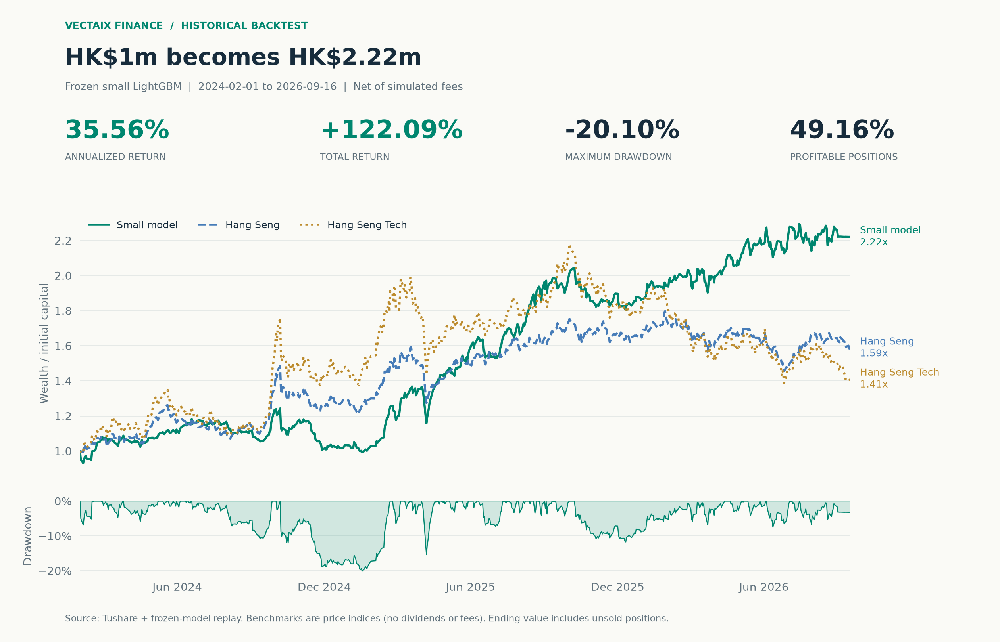
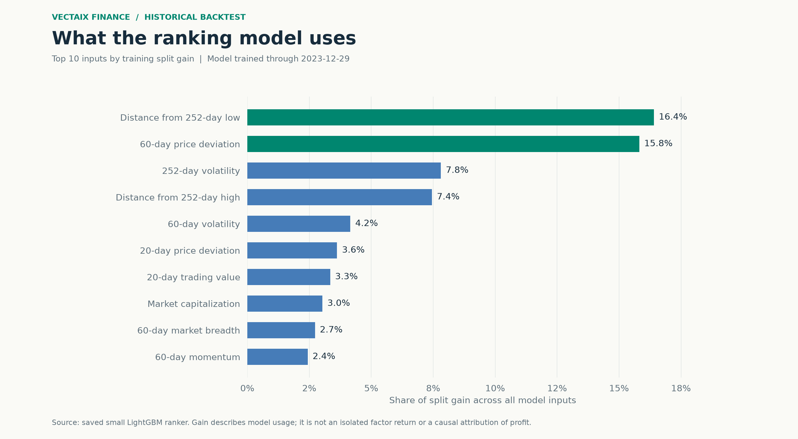
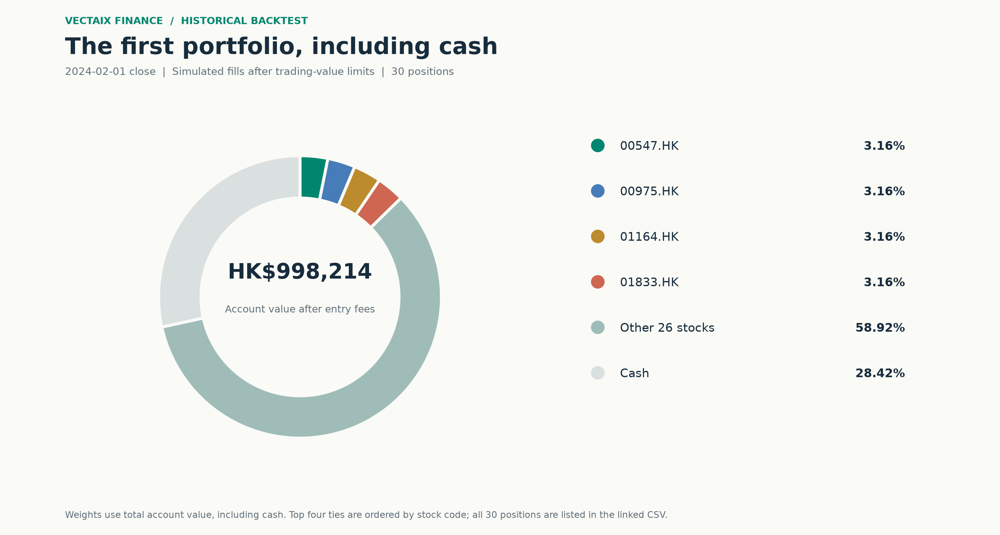
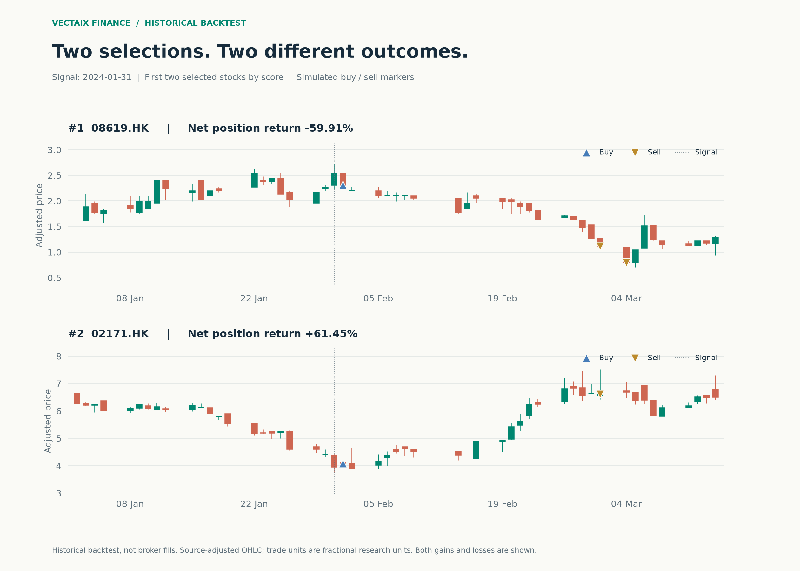
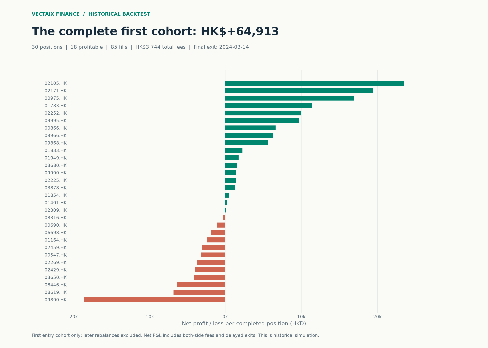
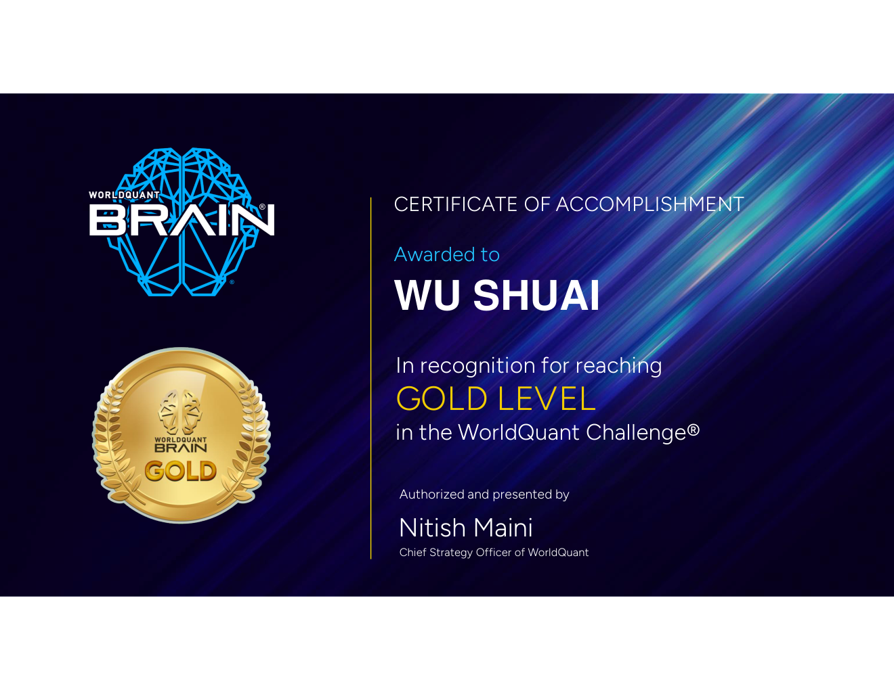

<div align="center">

# Vectaix Finance

香港株のマルチファクター選定。スコアから売買記録まで。

[](https://www.python.org/)
[](https://lightgbm.readthedocs.io/)
[](https://fastapi.tiangolo.com/)
[](https://github.com/Asher-S-Wu/Vectaix-Finance/stargazers)

[English](README.md) · [简体中文](README.zh-CN.md) · **日本語** · [한국어](README.ko.md)

</div>

Vectaix Financeは価格・売買高・市場環境に関する37項目をスコアにまとめ、毎月上位30銘柄の香港株を選びます。2024-02-01～2026-09-16の過去データによるバックテストで、小型LightGBMは手数料控除後の年率リターン **35.56%** を記録し、100万香港ドルが **222.09万香港ドル** になりました。



## 指数との比較

対象期間は **2024-02-01～2026-09-16**、644営業日です。4モデルが各月末に共通の評価可能な銘柄群を採点し、20営業日スコアの上位30銘柄を翌営業日の終値で模擬売買します。初期資金は100万香港ドル、片道手数料は0.25%、売買代金に対する参加率上限は1%です。

| モデル／指数 | 年率リターン | 累積リターン | 最大ドローダウン | 利益が出た保有ポジションの割合 |
| --- | ---: | ---: | ---: | ---: |
| **小型LightGBM** | **35.56%** | **122.09%** | -20.10% | 49.16% |
| 大型LightGBM | 32.28% | 108.30% | -15.49% | 49.21% |
| 線形モデル | 13.37% | 38.98% | -10.36% | 45.32% |
| ファクタースコア | 5.83% | 16.02% | -21.38% | 51.78% |
| ハンセン指数 | 19.27% | 58.77% | -19.95% | — |
| ハンセンテック指数 | 14.02% | 41.08% | -36.32% | — |

小型モデルは同期間のハンセン指数を年率で **16.28ポイント**、累積で **63.33ポイント** 上回りました。

利益が出た割合は、**手数料控除後の損益がプラスになった決済済みポジション数**で計算します。小型モデルは891件中438件で49.16%。片道手数料0.50%の条件では年率リターンが31.41%です。モデルは模擬手数料控除後、指数は配当を含まない価格指数で手数料控除なしです。

[日次の資産推移](docs/showcase/performance_curve.csv) · [4モデル・2種類の手数料条件](docs/showcase/model_comparison.csv) · [日付・条件・データ出典](docs/showcase/summary.json)

## 銘柄の順位を決める入力

小型モデルは、価格乖離、モメンタム、ボラティリティ、売買代金、時価総額、市場の騰落状況など37項目を使います。これらをスコアにまとめて銘柄を順位付けします。



252日安値からの距離と60日価格乖離は、全入力の分割ゲインの16.40%と15.81%を占めます。図は学習中にモデルが各入力をどの程度利用したかを示します。ポートフォリオ全体の成果は上の資産推移で確認できます。

[全入力の重要度](docs/showcase/factor_importance.csv) · [特徴量の計算](hk_quant/features.py) · [モデルの実装](hk_quant/models.py)

## 最初の売買を最後まで追う

この過去データによるシミュレーションでは、**最初の買い付けで取得した全30銘柄**を追跡します。月末の選定、翌営業日の購入、分割売却まで、85件の約定と現金残高を記録しています。

| 日付 | 記録 |
| --- | --- |
| 2024-01-31 | 月末スコアで30銘柄を選定。 |
| 2024-02-01 | 翌営業日終値で購入。売買代金の上限により一部の購入額を縮小。手数料込みの取得費は716,281.52香港ドル。 |
| 2024-03-01 | 売却予定日。保有分の売却を開始。 |
| 2024-03-04～03-14 | 売買代金の制限で残った分を分割売却し、3月14日に完了。 |

### 買い付け直後の保有比率

株式の評価額は714,495.29香港ドル、現金は283,718.48香港ドル。購入手数料控除後の総資産は998,213.76香港ドルで、現金比率は28.42%です。図は保有額上位4銘柄を個別に表示し、残り26銘柄をまとめています。



[選定時の順位](docs/showcase/first_cycle_selection.csv) · [全30銘柄の保有額と比率](docs/showcase/first_cycle_holdings.csv)

### ローソク足で見る売買

ローソク足は当時のスコア上位2銘柄、08619.HK（手数料控除後−59.91%）と02171.HK（+61.45%）です。08619.HKの2回の分割売却を含め、各模擬約定をマーカーで示しています。



| 日付 | 銘柄 | 売買 | 調整単位数 | 調整価格 | 約定金額（HKD） | 手数料（HKD） |
| --- | --- | --- | ---: | ---: | ---: | ---: |
| 2024-02-01 | 08619.HK | 買い | 4,885.528685 | 2.307179 | 11,271.79 | 28.18 |
| 2024-02-01 | 02171.HK | 買い | 7,742.082702 | 4.080000 | 31,587.70 | 78.97 |
| 2024-03-01 | 08619.HK | 売り | 1,951.329001 | 1.118632 | 2,182.82 | 5.46 |
| 2024-03-01 | 02171.HK | 売り | 7,742.082702 | 6.620000 | 51,252.59 | 128.13 |
| 2024-03-04 | 08619.HK | 売り | 2,934.199683 | 0.804017 | 2,359.15 | 5.90 |

約定表の数量は小数を許す調整済み研究単位です。[全85件の模擬約定](docs/showcase/first_cycle_trades.csv)には日付、銘柄、売買方向、数量、価格、金額、手数料と当該グループの現金残高を記録しています。

### 30銘柄全体の損益

30ポジション中18件が利益となりました。購入30件、売却55件の計85約定。取得費716,281.52香港ドルに対し売却純収入は781,194.89香港ドルで、**純利益は64,913.36香港ドル**です。売買両側の手数料3,744.12香港ドルを控除済み。取得費に対する利益率は9.06%、初期資金100万香港ドルへの寄与は6.49%でした。



[全ポジションの取得費・収入・リターン](docs/showcase/first_cycle_positions.csv)

`cohort_cash_after` はこの30ポジションの独立した現金勘定です。100万香港ドルから1,064,913.36香港ドルまでを追い、後続のリバランスで取得した新規ポジションは含みません。戦略全体の資産は日次の資産推移表にあります。

## 計算条件

- 売却後の利用可能な現金の95%を30枠に分けます。購入額はシグナル日時点の20日平均売買代金と約定日売買代金の両方の1%以内。買い切れない分は現金に残し、未売却分は後日の売却対象にします。
- 株式データはTushareの `hk_daily_adj` と `hk_adjfactor`、指数は `index_global` です。調整済み研究単位による計算で、過去の売買単位、正確な配当入金日、実際の注文約定は再現していません。
- 年率は経過暦日数で複利計算し、ドローダウンは日次資産から計算します。期末資産には未売却分の参考評価額を含み、小型モデルには1銘柄が残っています。参考評価額と実際に約定できる価格には差があり得ます。`execution_validated` は `false` です。
- 掲載モデルの学習データは2023-12-29までで、パラメータを固定して再生しています。この期間は候補モデルの比較に使用済みであり、独立したホールドアウト検証ではなく、過去データによる比較バックテストです。

## ローカル実行

リポジトリにはコード、テスト、5枚のバックテスト図、作者の認定・修了証、そのまま閲覧できる集計・事例CSVを含みます。**全市場データ、モデルの重み、予測と大量のバックテスト明細はローカルに保存し、配布には含めません。**

```bash
python -m venv .venv
```

Windows PowerShellは `.venv\Scripts\Activate.ps1`、macOS／Linuxは `source .venv/bin/activate` で有効化し、依存関係をインストールします。

```bash
pip install -r requirements.txt
```

保存済みモデル、予測、市場データと今回のバックテスト結果がある場合、リポジトリ直下から図を再生成できます。

```bash
python -m scripts.build_showcase
```

保存済み予測と同じ企業行動記録を使った再生コマンドです。再学習は行いません。

```bash
python -m hk_quant.fixed_backtest --forecast-root backtests/hk/fixed_models_20260916 --data-root data/hk/research_20260916 --source-root data/hk/universal --results-root backtests/hk/fixed_execution_20260916 --terminal-actions data/hk/universal/references/terminal_actions/cash_settlements.csv --transfers data/hk/universal/references/terminal_actions/board_transfers.csv
```

ローカル入力のパスと保存済みモデルの記録形式は[再生処理](hk_quant/fixed_backtest.py)、図に必要な入力は[図の生成処理](scripts/build_showcase.py)に定義しています。

## ディレクトリ

| パス | 内容 | 現在のソース配布 |
| --- | --- | --- |
| `hk_quant/` | 香港株のデータ処理、ファクター、モデル、固定モデル再生、API、ポートフォリオ提案 | 対象 |
| `scripts/build_showcase.py` | 既存結果から図と事例表を生成 | 対象 |
| `docs/assets/`、`docs/showcase/` | README用画像と小規模な結果表 | 対象 |
| `tests/` | 研究・サービスのテスト | 対象 |
| `legacy/` | 旧A株・初期香港株スクリプトと旧評価基準 | 対象 |
| `data/`、`models/` | 市場データ、特徴量、重み、公開済みスナップショット | 対象外 |
| `backtests/`、`reports/` | 全再生記録、自動生成レポート | 対象外 |
| `tmp/`、`output/` | 一時ファイル、ローカル出力 | 対象外 |

## APIとデプロイ

FastAPIは1・5・20・60営業日先の順位、予測、ポートフォリオ提案を提供します。サービスには別途公開した正式スナップショットが必要で、`models/hk/universal/active.json` から読み込みます。

```powershell
$env:HK_QUANT_API_KEY = "replace-with-a-long-random-key"
python -m hk_quant.api --host 0.0.0.0 --port 8000
```

| メソッド | パス | 用途 |
| --- | --- | --- |
| GET | `/health` | ヘルスチェック、認証不要 |
| GET | `/v1/model/status` | 正式モデルとデータ日付 |
| GET | `/v1/rankings?horizon=20&limit=50` | 市場ランキング |
| GET | `/v1/stocks/{code}/forecast` | 個別銘柄の予測 |
| POST | `/v1/portfolio/advice` | JSON保有明細による提案 |
| POST | `/v1/portfolio/advice/csv` | CSV保有明細による提案 |

ヘルスチェック以外のAPIには `X-API-Key` が必要です。ポートフォリオ提案は香港ドルで計算し、利用者の判断に向けて売買単位に合わせた注文案を返します。

Zeabur DevのPython環境でデプロイします。インストールは `pip install -r requirements.txt`、起動は `python -m hk_quant.api --host 0.0.0.0 --port $PORT`。`HK_QUANT_API_KEY` を設定し、対応するデータと正式スナップショットを別途マウントします。Dockerは不要です。

<a id="credentials"></a>

## 作者について

作者の **Shuai Wu** はWorldQuant Challengeで **Gold Level** を取得しています。

<p align="center">
  
</p>

## Star History

<p align="center">
  <a href="https://www.star-history.com/#Asher-S-Wu/Vectaix-Finance&amp;Date">
    
  </a>
</p>
