<div align="center">

# Vectaix Finance

独立した米国株、中国本土A株、香港株の選定モデル。学習済み重み、過去の検証結果、売買記録を公開。

[](https://www.python.org/)
[](https://scikit-learn.org/stable/modules/generated/sklearn.linear_model.Ridge.html)
[](https://lightgbm.readthedocs.io/)
[](https://fastapi.tiangolo.com/)
[](https://github.com/Asher-S-Wu/Vectaix-Finance/stargazers)

[English](README.md) · [简体中文](README.zh-CN.md) · **日本語** · [한국어](README.ko.md)

</div>

Vectaix Financeには、人民元建ての中国本土A株と香港ドル建ての香港株を扱う個別の研究パイプラインがあります。A株の公開版には学習済みのRidge、ファクタースコア、LightGBMモデルを含みます。香港株の節では月次銘柄選定と約定ごとの再生結果を紹介します。

[独立米国株モデル](#us) · [A株モデル](#ashare) · [香港株バックテスト](#hong-kong) · [ローカル実行](#ローカル実行)

<a id="us"></a>

## 独立米国株モデル：実験2

**履歴の補完と学習済み順位付け重みにより再利用期間の比較は改善しましたが、信頼できるサンプル外優位性は未確認です。** 凍結した `ridge_rank_5y` の直近 IC 点推定は4期間とも正ですが、95%区間はすべてゼロを含みます。確率スキルは全期間で負、時系列に沿ったネスト型選択の外側平均 IC は **+0.0009** にとどまります。実運用の適格性はありません。

引き続き **2015-06-30** 時点、**2015-09-02** 公表の OEF 固定集合 **101の元の株式クラス**を使用します。未取得だった **12銘柄識別単位**に境界を明示した履歴を補い、**15,284件**の有効価格観測を追加しました。101/101に一部履歴があることは、完全な時点情報や終端資産価値を意味しません。FOXA の価格ソースは **2018-03-27** で途切れ、実際の2019-03-19終了より前です。DD は未モデル化の現物分配後の **2015-07-02** から開始します。裏付けのない合併、現金決済、CVR の結果は不明のままです。

### ローリング開発と時系列モデル選択

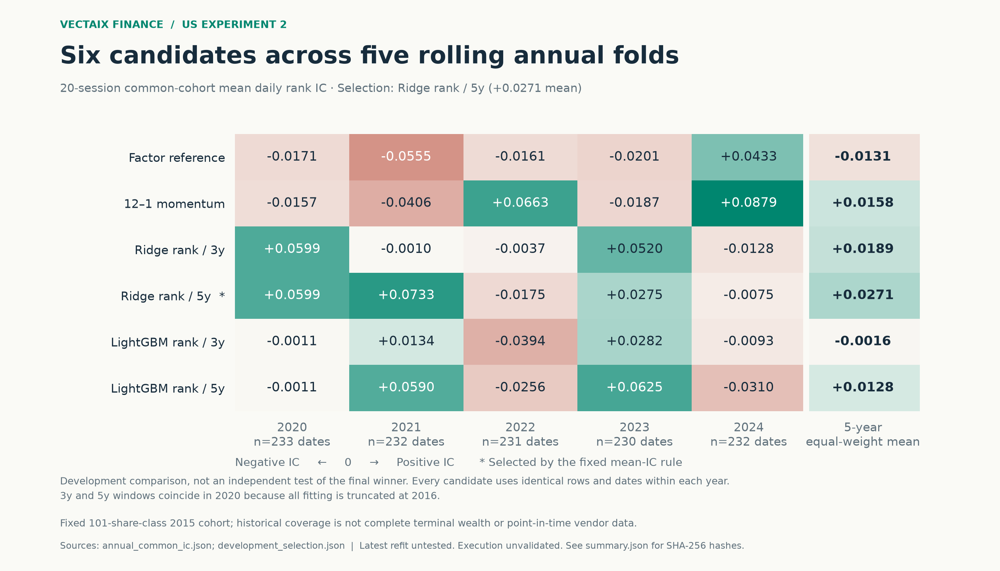

事前指定6候補は固定ファクター、12–1モメンタム、3年/5年窓の独立 Ridge・LightGBM 順位モデルです。学習型順位モデルは固定24特徴と各日の中心化リターン順位を使用し、基準モデルは事前指定のスコアを維持します。**30回の候補・年次フォールド学習**を実施し、各評価年の前年を校正、その前を学習に使用しました。5年 Ridge の年次平均 IC **+0.0271** が首位で、5年中3年が正でした。この選択統計自体は独立テストではありません。

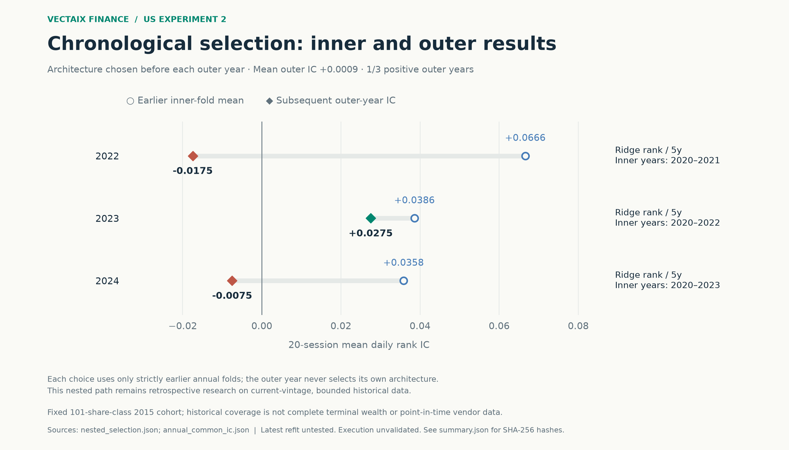

2022年は2020–2021年だけで選択し、2023年と2024年もそれぞれ過去の年だけを使用します。3回とも5年 Ridge が選ばれ、外側 IC は **−0.0175 / +0.0275 / −0.0075**、平均 **+0.0009**、正の年は1/3です。時間順の分離は強まりますが、回顧的データと固定集合の制約は残ります。

### REUSED DIAGNOSTIC：2025–2026年は新しいホールドアウトではありません

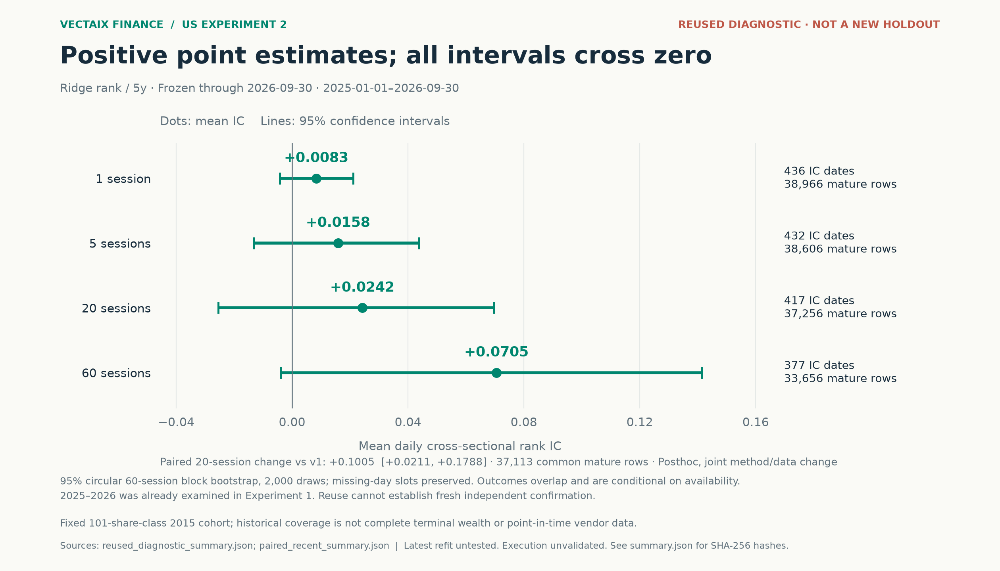

最終4期間のヘッドは2023年まで学習し、2024年で校正後、**2025-01-01–2026-09-30** を通じて凍結します。この期間は実験1ですでに確認済みのため、実験2の新しい独立確認にはなりません。

| 期間（取引日） | 平均 Rank IC | 95%区間 | Brier skill | リターン区間包含率 |
| --- | ---: | --- | ---: | ---: |
| 1 | +0.0083 | [−0.0042, +0.0211] | −0.012% | 79.40% |
| 5 | +0.0158 | [−0.0131, +0.0438] | −0.026% | 81.71% |
| 20 | +0.0242 | [−0.0255, +0.0696] | −0.286% | 82.37% |
| 60 | +0.0705 | [−0.0040, +0.1415] | −0.677% | 83.63% |

**同一の成熟した銘柄・日付観測37,113件、IC日数417日**では、20日 IC がv1の **−0.0772** からv2の **+0.0233** に変化し、ペア差は **+0.1005**（95%区間 **[+0.0211, +0.1788]**）です。上表の+0.0242には復元した WBA 観測が追加されるため値が異なります。モデルと学習データを同時に変更した事後比較であり、改善要因の特定や新規の独立確認には使えません。

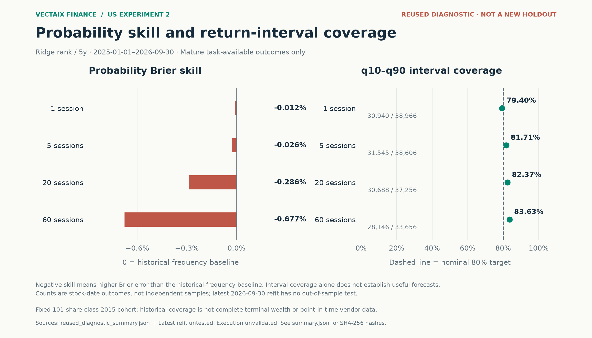

IC区間は60取引日の循環ブロックを2,000回抽出します。Brier skill は過去の上昇頻度を基準とし、負は誤差増大を示します。包含率の目標は80%です。重複する観測は独立標本ではありません。**2026-09-30の最新再学習モデルはサンプル外未評価**です。

**全期間のポートフォリオ成績は算出不可です。** 主戦略、費用ストレス、101枠集合には2025-08-27以降も評価未解決の WBA 保有が残り、**274取引日に評価欠損**があります。総リターン、年率リターン、最大ドローダウンは null のままです。古い参照価格を検証済み収益として扱わず、成績を主張する資産曲線も掲載しません。

[方法と制約](docs/us/v2/README.md) · [復元履歴図](docs/assets/us/v2/source_recovery.png) · [ローリングCSV](docs/showcase/us/v2/rolling_selection.csv) · [ネスト型CSV](docs/showcase/us/v2/nested_selection.csv) · [再利用診断CSV](docs/showcase/us/v2/reused_diagnostic.csv) · [ペア比較](docs/showcase/us/v2/paired_recent.csv) · [リプレイ状態](docs/showcase/us/v2/replay_status.csv) · [ハッシュと定義](docs/showcase/us/v2/summary.json)

データ取得や再学習なしでv2の5図と集計CSVを再生成：`python -m scripts.build_us_v2_showcase`

初回実験は以下にそのまま保存しています。

<a id="us-v1"></a>

## 独立した米国株モデル：実験1

**固定モデルの確認結果は順位付けの優位性を示していません。** 全4期間の平均Rank ICが負で、20・60営業日の95%区間は全体がゼロ未満です。リターン区間の被覆率も全期間で80%を下回ります。実運用向けの検証は完了していません。

公開データによる初回実験の独立した米ドル建てモデルは、**2015-06-30** 時点の OEF 保有銘柄を固定した **101の元の株式クラス**を対象とします。この一覧の公表日は **2015-09-02** です。Yahoo Finance の公開履歴は2014-01-02から2026-09-30をカバーします。提供元の名称と履歴期間の限定的な照合により **89の履歴**を採用し、**12の元の証券識別単位**は除外または取得不能のままです。内訳は沿革未解決5件、履歴欠落5件、ティッカー再利用2件で、予測総数には全件を残しています。現在取得できる版の履歴による限定的な遡及研究であり、生存者バイアスのない推定や米国市場全体の推定ではありません。AKShare は補助照合にのみ使用し、調整履歴の不足とティッカー再利用のため学習元には採用していません。

米国株パイプラインは、固定ファクタースコア、Ridge、小型・大型 LightGBM を個別に学習し、A株・香港株の学習済み重みを再利用しません。2016–2022年を学習、2023年を校正、2024年を選定に使い、選んだモデルだけを固定して2025-01-01から2026-09-30の確認期間で評価します。

### 米国株の固定モデル確認結果

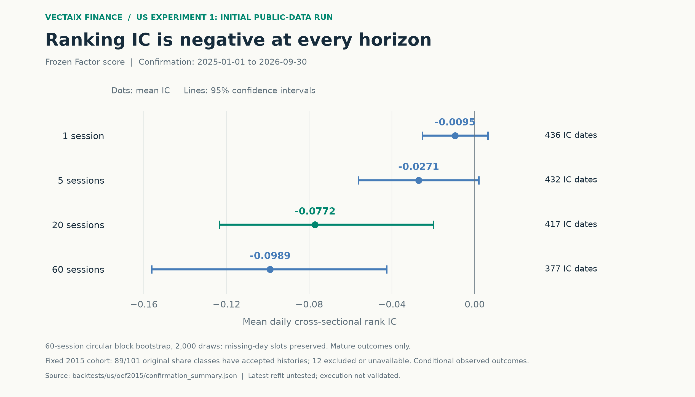

| 予測期間（営業日） | 平均日次Rank IC | 95%区間 | 上昇確率のBrier skill | リターン区間の被覆率 |
| --- | ---: | --- | ---: | ---: |
| 1 | -0.0095 | [-0.0254, 0.0064] | -0.02% | 72.95% |
| 5 | -0.0271 | [-0.0562, 0.0019] | +0.08% | 73.82% |
| 20 | -0.0772 | [-0.1233, -0.0200] | +0.06% | 74.67% |
| 60 | -0.0989 | [-0.1562, -0.0426] | -2.89% | 69.57% |

Rank ICは日々の銘柄横断で求めたスコアと将来の調整後価格リターンのSpearman相関です。95%区間は欠測日の位置を残し、60営業日の循環ブロックを2,000回再抽出して推定します。指標は観測できた満期済み結果を条件としており、証券履歴の欠落や提供元の価格調整により解釈が制約されます。

### 米国株の選定と校正の確認

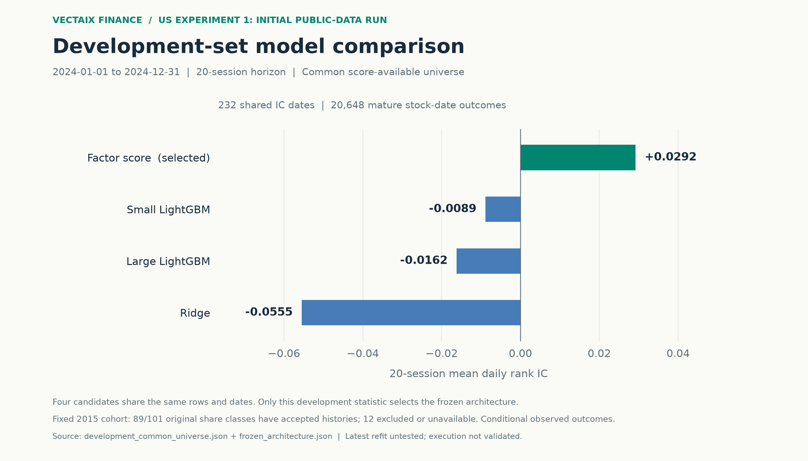

選ばれたファクタースコアの順位付け重みは事前設定で、確率とリターン区間の校正を米国株データで個別に学習しています。

20営業日先の平均日次Rank IC **0.0292** により **Factor score** を選定しました。4候補に共通する **232のIC日付**と **20,648件の満期済み銘柄・日付観測**を使っています。確認データは選定や調整に使用していません。

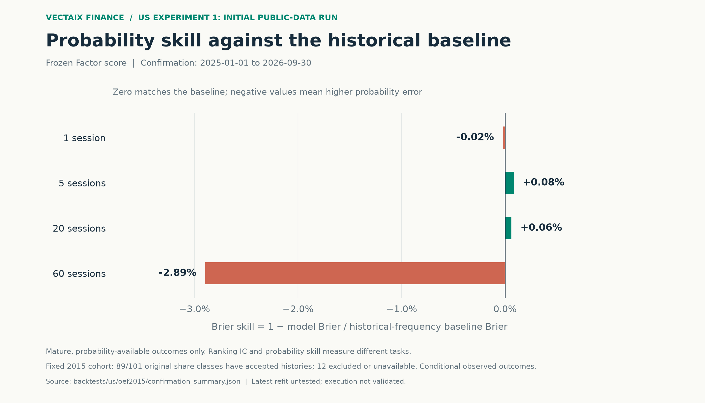

ゼロは過去の上昇頻度基準と同等、負の値はBrier誤差がより大きいことを表します。順位付けICが正でも、確率予測が基準を上回るとは限りません。

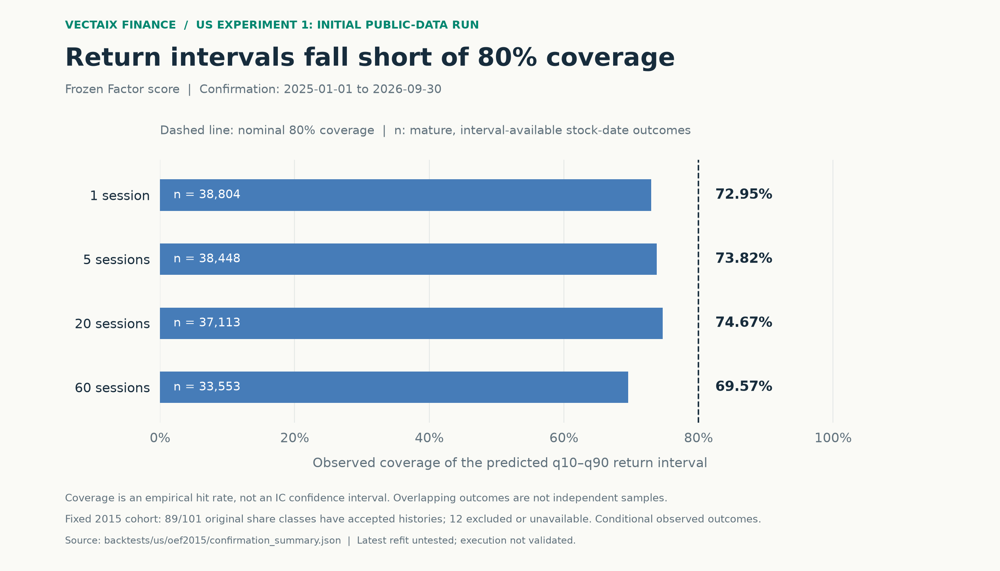

q10–q90リターン区間の目標被覆率は80%です。分母は満期済みかつ各タスクで利用可能な観測のみで、期間が重なる銘柄・日付観測は独立標本ではありません。別途保存した2026-09-30時点の最新再学習モデルは**サンプル外未評価**です。執行は未検証、適格性は false のままで、これらの予測診断は投資可能なポートフォリオ収益の検証や将来成績の保証ではありません。

### 条件付き米国株研究シミュレーション

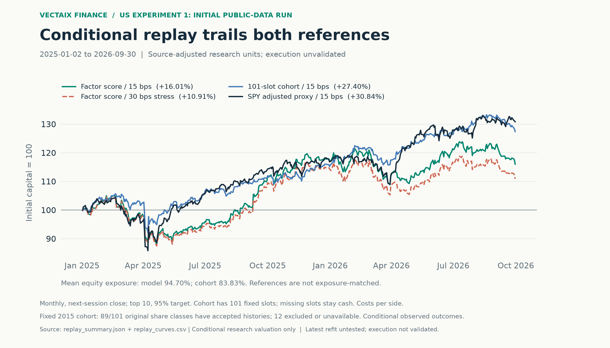

固定ファクター戦略の条件付き研究シミュレーションの累積リターンは **+16.01%** で、固定101枠の銘柄群 **+27.40%** と SPY調整後価格プロキシ **+30.84%** を下回りました。片道コストを15から30bpに倍増するとモデルは **+10.91%** となります。月次上位10銘柄を翌営業日終値で模擬執行し、投資目標は95%です。欠落した銘柄枠は現金のままです。平均株式エクスポージャーはモデル94.70%、銘柄群83.83%で、同一エクスポージャーの比較ではありません。米ドル建ての調整後研究単位による参考例であり、執行と実株式の企業行動台帳は未検証です。

[再生曲線CSV](docs/showcase/us/conditional_replay.csv) · [再生指標CSV](docs/showcase/us/conditional_replay_summary.csv) · [再生の前提](backtests/us/oef2015/replay_summary.json)

[米国株のデータと手法](docs/us/README.md) · [データ監査](backtests/us/oef2015/source_audit.json) · [固定候補モデル](models/us/oef2015/frozen/) · [最新再学習](models/us/oef2015/latest/) · [選定CSV](docs/showcase/us/model_selection.csv) · [確認CSV](docs/showcase/us/confirmation.csv) · [図の定義とハッシュ](docs/showcase/us/summary.json)

市場データの取得や再学習なしで、集計済み証拠から5つの図とCSVを再生成：`python -m scripts.build_us_showcase`

<a id="ashare"></a>

## A株モデル

A株パイプラインは価格、売買高、時価総額、市場環境に関する37項目のファクターを計算します。共通の評価可能な銘柄群で固定ファクタースコア、Ridge、小型・大型LightGBMを比較し、2024年の開発データにおける20営業日先の平均日次Rank ICでRidgeを選定しました。入力は事前に定めた10項目の基礎特徴量と `log_horizon` です。

2016年から2022年を学習、2023年を個別の校正に使用します。選定後のモデルを固定し、2025年から2026-09-30までの確認期間で評価しました。この確認データは選定や調整に使用していません。

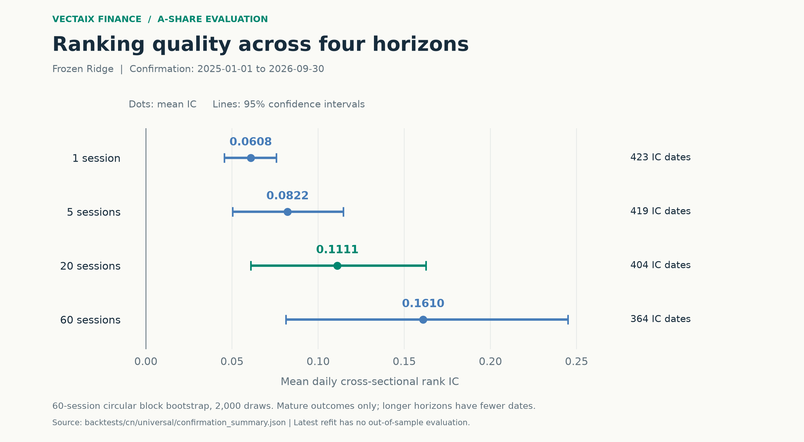

| 予測期間（営業日） | 平均日次Rank IC | 95%区間 | 上昇確率のBrier skill |
| --- | ---: | --- | ---: |
| 1 | 0.0608 | [0.0455, 0.0758] | -0.35% |
| 5 | 0.0822 | [0.0503, 0.1145] | -0.54% |
| 20 | 0.1111 | [0.0608, 0.1626] | -0.22% |
| 60 | 0.1610 | [0.0812, 0.2450] | -1.15% |

Rank ICは各日の銘柄横断で求めたスコアと将来リターンのSpearman相関です。区間は60営業日の循環ブロック・ブートストラップを2,000回実行して推定しており、この過去期間の順位付けの質を表します。確率のBrier skillは全期間で負となり、過去の上昇頻度を使う基準を下回りました。別途公開した2026-09-30時点の最新Ridge再学習モデルは、現在の入力による研究用で、サンプル外評価はまだありません。

一部の企業行動と証券の最終評価額が未確認のため、ポートフォリオの収益、CAGR、最大ドローダウンは確定できません。スナップショットは `eligible=false`、`execution_validated=false` です。過去の結果は将来の成績を保証しません。

公開版には4つの[固定候補モデル](models/cn/universal/frozen/)と[最新Ridgeの重み・メタデータ](models/cn/universal/snapshots/cn-linear-latest-20260930-v1/)があります。ベンダーの元データと銘柄別予測スナップショットは、利用者が別途利用許諾を得たTushareデータで用意する必要があります。公開版にはサービス用の完全なスナップショットがないため、クローン直後はモデルの確認と合成データによるテストが可能です。実銘柄のランキングには完全なローカル入力が必要です。

[公開版ガイド（中国語）](ASHARE_RELEASE.zh-CN.md) · [研究報告PDF（中国語）](delivery_report/ashare_training_report.zh-CN.pdf) · [手法と再現手順](docs/ashare/README.md) · [確認期間の指標](backtests/cn/universal/confirmation_summary.json) · [A株ソース](ashare_quant/)

### 開発データによるモデル選定

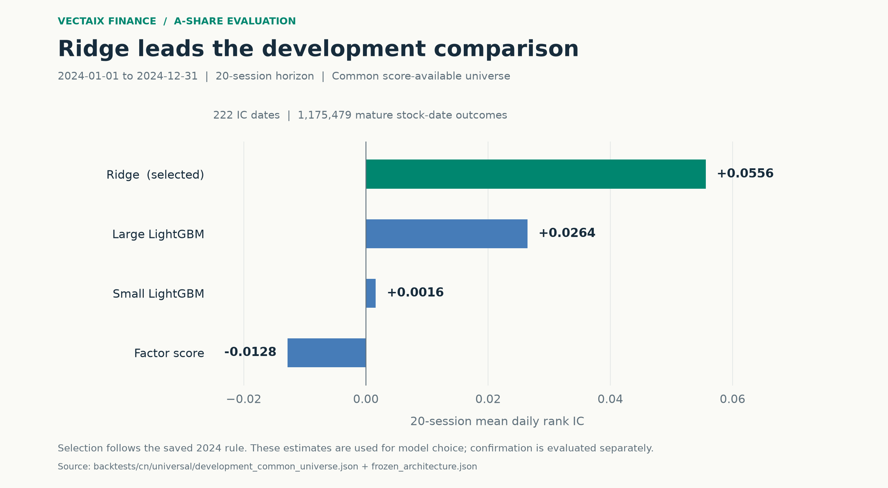

Ridgeの2024年開発期間の平均日次Rank ICは0.0556でした。4候補は同じ222日分のICと、結果が確定した1,175,479件の銘柄・日付観測で比較しています。図は固定モデルの選定に使った開発統計量です。

[モデル比較CSV](docs/showcase/cn/model_selection.csv) · [固定した選定記録](backtests/cn/universal/frozen_architecture.json)

### 確率とリターン区間の検証

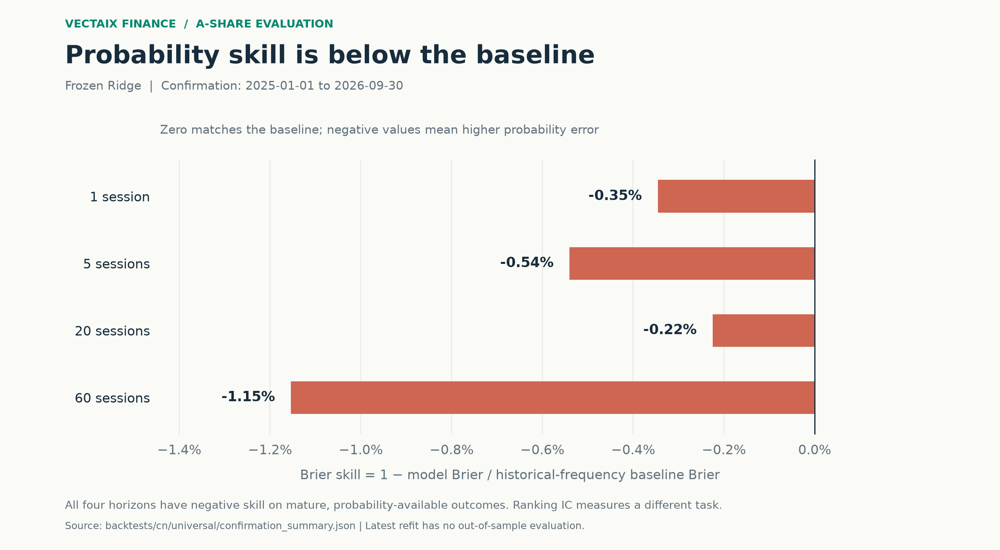

ゼロは過去の上昇頻度を使う基準と同等です。負の値は、その基準よりモデルのBrier誤差が大きいことを表します。順位付けのICが正でも、確率予測が基準を上回るとは限りません。

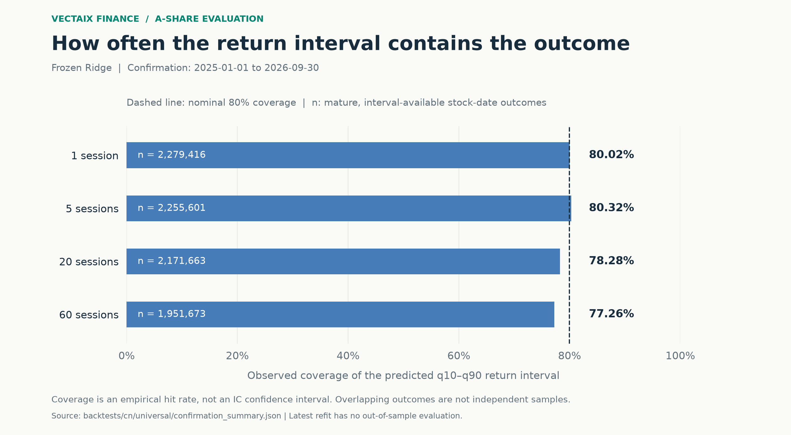

q10–q90の予測リターン区間は80%のカバー率を目標とします。1・5・20・60営業日先の観測カバー率は80.02%、80.32%、78.28%、77.26%でした。分母は結果が確定し、区間を計算できた観測のみです。期間の重なる銘柄・日付観測は独立した標本ではありません。各図は固定モデルの確認結果で、最新再学習モデルのサンプル外評価はまだありません。

[確認指標CSV](docs/showcase/cn/confirmation.csv) · [図の出典と定義](docs/showcase/cn/summary.json)

<a id="hong-kong"></a>

## 香港株バックテスト

香港株パイプラインは価格・売買高・市場環境に関する37項目をスコアにまとめ、毎月上位30銘柄の香港株を選びます。2024-02-01～2026-09-16の過去データによるバックテストで、小型LightGBMは手数料控除後の年率リターン **35.56%** を記録し、100万香港ドルが **222.09万香港ドル** になりました。

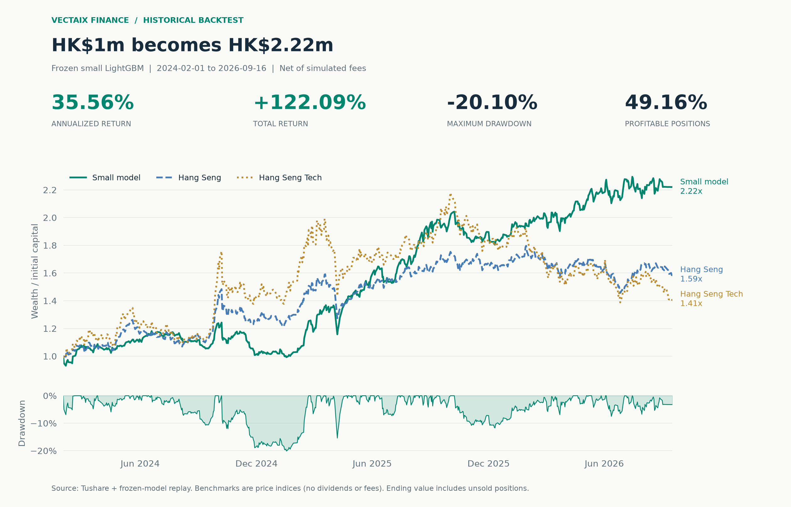

### 指数との比較

対象期間は **2024-02-01～2026-09-16**、644営業日です。4モデルが各月末に共通の評価可能な銘柄群を採点し、20営業日スコアの上位30銘柄を翌営業日の終値で模擬売買します。初期資金は100万香港ドル、片道手数料は0.25%、売買代金に対する参加率上限は1%です。

| モデル／指数 | 年率リターン | 累積リターン | 最大ドローダウン | 利益が出た保有ポジションの割合 |
| --- | ---: | ---: | ---: | ---: |
| **小型LightGBM** | **35.56%** | **122.09%** | -20.10% | 49.16% |
| 大型LightGBM | 32.28% | 108.30% | -15.49% | 49.21% |
| 線形モデル | 13.37% | 38.98% | -10.36% | 45.32% |
| ファクタースコア | 5.83% | 16.02% | -21.38% | 51.78% |
| ハンセン指数 | 19.27% | 58.77% | -19.95% | — |
| ハンセンテック指数 | 14.02% | 41.08% | -36.32% | — |

小型モデルは同期間のハンセン指数を年率で **16.28ポイント**、累積で **63.33ポイント** 上回りました。

利益が出た割合は、**手数料控除後の損益がプラスになった決済済みポジション数**で計算します。小型モデルは891件中438件で49.16%。片道手数料0.50%の条件では年率リターンが31.41%です。モデルは模擬手数料控除後、指数は配当を含まない価格指数で手数料控除なしです。

[日次の資産推移](docs/showcase/performance_curve.csv) · [4モデル・2種類の手数料条件](docs/showcase/model_comparison.csv) · [日付・条件・データ出典](docs/showcase/summary.json)

### 銘柄の順位を決める入力

小型モデルは、価格乖離、モメンタム、ボラティリティ、売買代金、時価総額、市場の騰落状況など37項目を使います。これらをスコアにまとめて銘柄を順位付けします。

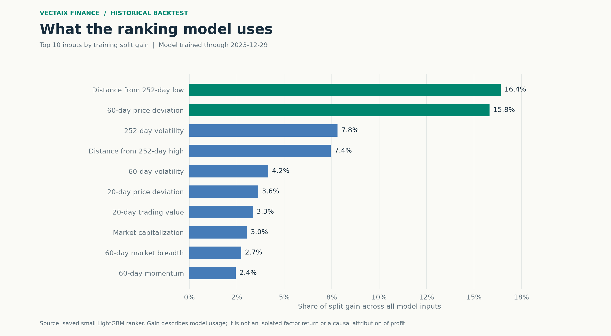

252日安値からの距離と60日価格乖離は、全入力の分割ゲインの16.40%と15.81%を占めます。図は学習中にモデルが各入力をどの程度利用したかを示します。ポートフォリオ全体の成果は上の資産推移で確認できます。

[全入力の重要度](docs/showcase/factor_importance.csv) · [特徴量の計算](hk_quant/features.py) · [モデルの実装](hk_quant/models.py)

### 最初の売買を最後まで追う

この過去データによるシミュレーションでは、**最初の買い付けで取得した全30銘柄**を追跡します。月末の選定、翌営業日の購入、分割売却まで、85件の約定と現金残高を記録しています。

| 日付 | 記録 |
| --- | --- |
| 2024-01-31 | 月末スコアで30銘柄を選定。 |
| 2024-02-01 | 翌営業日終値で購入。売買代金の上限により一部の購入額を縮小。手数料込みの取得費は716,281.52香港ドル。 |
| 2024-03-01 | 売却予定日。保有分の売却を開始。 |
| 2024-03-04～03-14 | 売買代金の制限で残った分を分割売却し、3月14日に完了。 |

#### 買い付け直後の保有比率

株式の評価額は714,495.29香港ドル、現金は283,718.48香港ドル。購入手数料控除後の総資産は998,213.76香港ドルで、現金比率は28.42%です。図は保有額上位4銘柄を個別に表示し、残り26銘柄をまとめています。

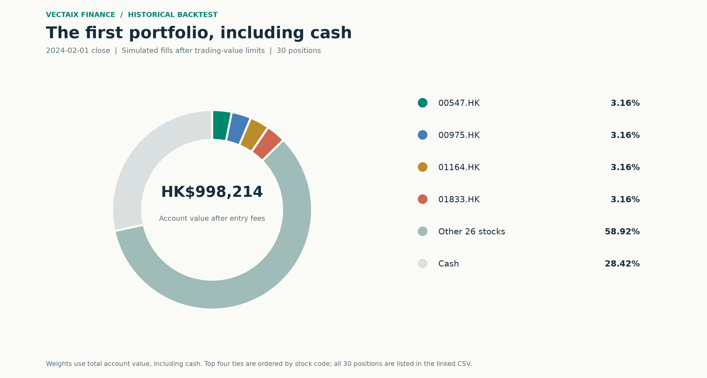

[選定時の順位](docs/showcase/first_cycle_selection.csv) · [全30銘柄の保有額と比率](docs/showcase/first_cycle_holdings.csv)

#### ローソク足で見る売買

ローソク足は当時のスコア上位2銘柄、08619.HK（手数料控除後−59.91%）と02171.HK（+61.45%）です。08619.HKの2回の分割売却を含め、各模擬約定をマーカーで示しています。

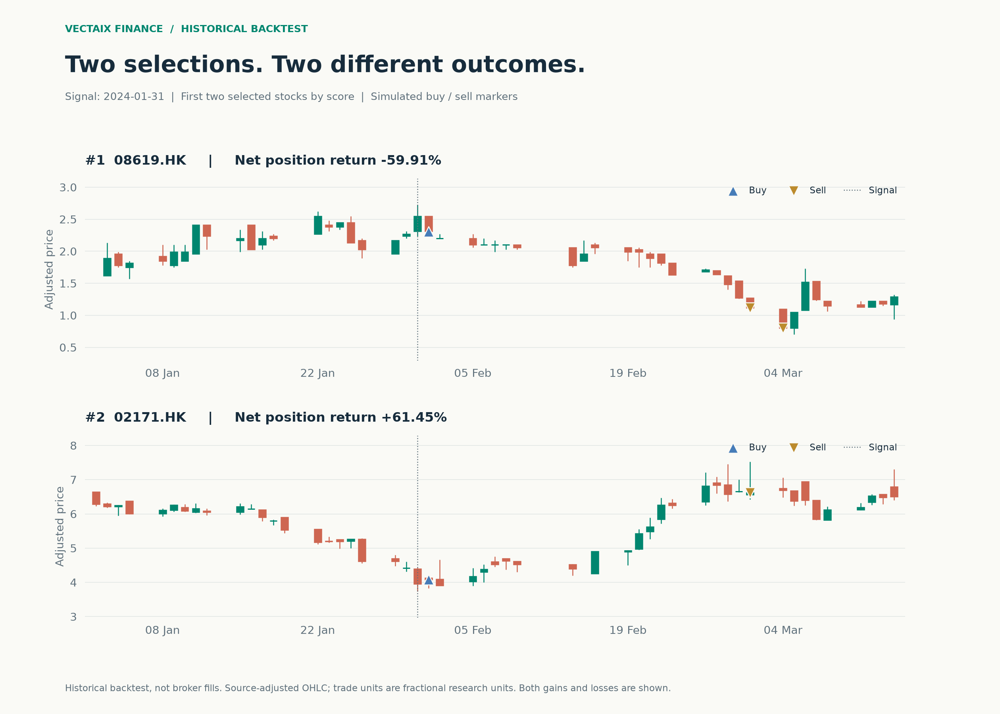

| 日付 | 銘柄 | 売買 | 調整単位数 | 調整価格 | 約定金額（HKD） | 手数料（HKD） |
| --- | --- | --- | ---: | ---: | ---: | ---: |
| 2024-02-01 | 08619.HK | 買い | 4,885.528685 | 2.307179 | 11,271.79 | 28.18 |
| 2024-02-01 | 02171.HK | 買い | 7,742.082702 | 4.080000 | 31,587.70 | 78.97 |
| 2024-03-01 | 08619.HK | 売り | 1,951.329001 | 1.118632 | 2,182.82 | 5.46 |
| 2024-03-01 | 02171.HK | 売り | 7,742.082702 | 6.620000 | 51,252.59 | 128.13 |
| 2024-03-04 | 08619.HK | 売り | 2,934.199683 | 0.804017 | 2,359.15 | 5.90 |

約定表の数量は小数を許す調整済み研究単位です。[全85件の模擬約定](docs/showcase/first_cycle_trades.csv)には日付、銘柄、売買方向、数量、価格、金額、手数料と当該グループの現金残高を記録しています。

#### 30銘柄全体の損益

30ポジション中18件が利益となりました。購入30件、売却55件の計85約定。取得費716,281.52香港ドルに対し売却純収入は781,194.89香港ドルで、**純利益は64,913.36香港ドル**です。売買両側の手数料3,744.12香港ドルを控除済み。取得費に対する利益率は9.06%、初期資金100万香港ドルへの寄与は6.49%でした。

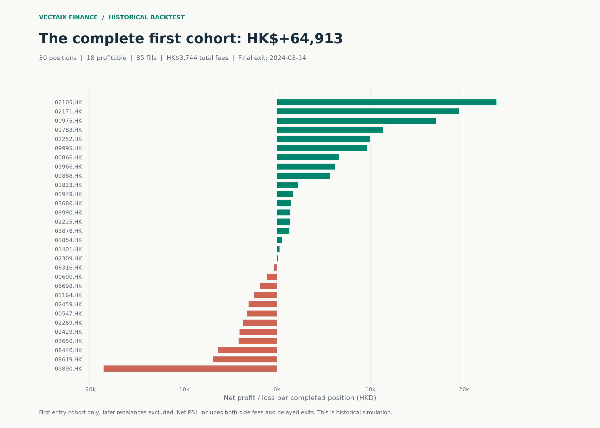

[全ポジションの取得費・収入・リターン](docs/showcase/first_cycle_positions.csv)

`cohort_cash_after` はこの30ポジションの独立した現金勘定です。100万香港ドルから1,064,913.36香港ドルまでを追い、後続のリバランスで取得した新規ポジションは含みません。戦略全体の資産は日次の資産推移表にあります。

### 計算条件

- 売却後の利用可能な現金の95%を30枠に分けます。購入額はシグナル日時点の20日平均売買代金と約定日売買代金の両方の1%以内。買い切れない分は現金に残し、未売却分は後日の売却対象にします。
- 株式データはTushareの `hk_daily_adj` と `hk_adjfactor`、指数は `index_global` です。調整済み研究単位による計算で、過去の売買単位、正確な配当入金日、実際の注文約定は再現していません。
- 年率は経過暦日数で複利計算し、ドローダウンは日次資産から計算します。期末資産には未売却分の参考評価額を含み、小型モデルには1銘柄が残っています。参考評価額と実際に約定できる価格には差があり得ます。`execution_validated` は `false` です。
- 掲載モデルの学習データは2023-12-29までで、パラメータを固定して再生しています。この期間は候補モデルの比較に使用済みであり、独立したホールドアウト検証ではなく、過去データによる比較バックテストです。

## ローカル実行

Python 3.12とリポジトリで固定した依存バージョンを推奨します。コード、テスト、A株の学習済み重みと集計レポート、香港株の図と事例CSVを含みます。ベンダーの市場データと銘柄別予測には、利用許諾を得た入力を別途用意してください。香港株の重みと全再生記録は別途保存されています。

```bash
python -m venv .venv
```

Windows PowerShellは `.venv\Scripts\Activate.ps1`、macOS／Linuxは `source .venv/bin/activate` で有効化し、依存関係をインストールします。

```bash
pip install -r requirements.txt
```

macOS／Linuxのシェルでテスト用依存関係を追加すると、A株の自己完結型テストを実行できます。

```bash
pip install pytest==9.1.1 httpx==0.28.1
python -m pytest -q tests/test_ashare_*.py
```

完全な合成データ結合テストは手動で有効にします。コマンドは[公開版ガイド](ASHARE_RELEASE.zh-CN.md#安装与验证)にあります。一時ディレクトリでデータを生成し、パイプラインとAPIを確認します。全体のテスト範囲と香港株の不足サンプルは[検証記録](docs/ashare/verification.md)を参照してください。

### A株の図を再生成

4枚のA株の図とCSV表は、リポジトリに含まれる集計JSON指標から生成します。依存関係のインストール後、ルートで実行します。

```bash
python -m scripts.build_ashare_showcase
```

[生成スクリプト](scripts/build_ashare_showcase.py)は固定した選定記録と指標の計算を検査し、`docs/assets/cn/` と `docs/showcase/cn/` に出力します。ベンダーの元データは不要で、モデルの再学習も行いません。

### 香港株の結果を再生成

保存済みモデル、予測、市場データと今回のバックテスト結果がある場合、リポジトリ直下から図を再生成できます。

```bash
python -m scripts.build_showcase
```

保存済み予測と同じ企業行動記録を使った再生コマンドです。再学習は行いません。

```bash
python -m hk_quant.fixed_backtest --forecast-root backtests/hk/fixed_models_20260916 --data-root data/hk/research_20260916 --source-root data/hk/universal --results-root backtests/hk/fixed_execution_20260916 --terminal-actions data/hk/universal/references/terminal_actions/cash_settlements.csv --transfers data/hk/universal/references/terminal_actions/board_transfers.csv
```

ローカル入力のパスと保存済みモデルの記録形式は[再生処理](hk_quant/fixed_backtest.py)、図に必要な入力は[図の生成処理](scripts/build_showcase.py)に定義しています。

## ディレクトリ

| パス | 内容 | 配布対象 |
| --- | --- | --- |
| `ashare_quant/` | A株の収集、ファクター、モデル、再生、API、ポートフォリオ提案 | 対象 |
| `models/cn/universal/` | 4つの固定候補と最新Ridgeの重み・メタデータ | 対象 |
| `backtests/cn/universal/` | 実験手順、選定記録、集計評価 | 集計のみ |
| `docs/ashare/`、`delivery_report/` | A株の手法、検証記録、中国語報告 | 対象 |
| `hk_quant/` | 香港株のデータ処理、ファクター、モデル、固定モデル再生、API、ポートフォリオ提案 | 対象 |
| `scripts/build_ashare_showcase.py` | 保存済み集計指標からA株の評価図と表を生成 | 対象 |
| `scripts/build_showcase.py` | 香港株の既存結果から図と事例表を生成 | 対象 |
| `docs/assets/`、`docs/showcase/` | A株・香港株のREADME用画像と小規模な結果表 | 対象 |
| `tests/` | A株・香港株の研究とサービスのテスト | 対象 |
| `legacy/` | 旧A株・初期香港株スクリプトと評価基準 | 対象 |
| `data/` | ベンダー入力と生成データ | 対象外 |
| `models/hk/`、`backtests/hk/` | 香港株の重み、予測、全再生記録 | 対象外 |
| `reports/`、`tmp/`、`output/` | ローカルレポート、一時ファイル、出力 | 対象外 |

## APIとデプロイ

両方のFastAPIサービスが、1・5・20・60営業日先の予測について下表のエンドポイントを提供します。それぞれの市場データと完全な予測スナップショットが必要です。

### A株API

利用許諾を得た入力を用意し、[スナップショットと確率評価の開示手順](docs/ashare/README.md#attach-observed-probability-evidence-before-serving)を完了してください。環境変数 `ASHARE_QUANT_API_KEY` を安全に設定して、人民元建てサービスを起動します。

```bash
python -m ashare_quant.api --host 127.0.0.1 --port 8001
```

実銘柄のランキングや保有明細への提案には、対応するデータ、予測、有効なスナップショット参照が必要です。公開された重みだけでは完全なサービスを実行できません。APIは研究結果と注文案を返し、注文は送信しません。

### 香港株API

サービスには別途公開した正式スナップショットが必要で、`models/hk/universal/active.json` から読み込みます。

```powershell
$env:HK_QUANT_API_KEY = "replace-with-a-long-random-key"
python -m hk_quant.api --host 0.0.0.0 --port 8000
```

### 共通エンドポイント

| メソッド | パス | 用途 |
| --- | --- | --- |
| GET | `/health` | ヘルスチェック、認証不要 |
| GET | `/v1/model/status` | 正式モデルとデータ日付 |
| GET | `/v1/rankings?horizon=20&limit=50` | 市場ランキング |
| GET | `/v1/stocks/{code}/forecast` | 個別銘柄の予測 |
| POST | `/v1/portfolio/advice` | JSON保有明細による提案 |
| POST | `/v1/portfolio/advice/csv` | CSV保有明細による提案 |

両サービスともヘルスチェック以外のAPIには `X-API-Key` が必要です。香港株のポートフォリオ提案は香港ドルで計算し、利用者の判断に向けて売買単位に合わせた注文案を返します。

### 香港株のデプロイ

Zeabur DevのPython環境でデプロイします。インストールは `pip install -r requirements.txt`、起動は `python -m hk_quant.api --host 0.0.0.0 --port $PORT`。`HK_QUANT_API_KEY` を設定し、対応するデータと正式スナップショットを別途マウントします。Dockerは不要です。

<a id="credentials"></a>

## 作者について

作者の **Shuai Wu** はWorldQuant Challengeで **Gold Level** を取得しています。

<p align="center">
  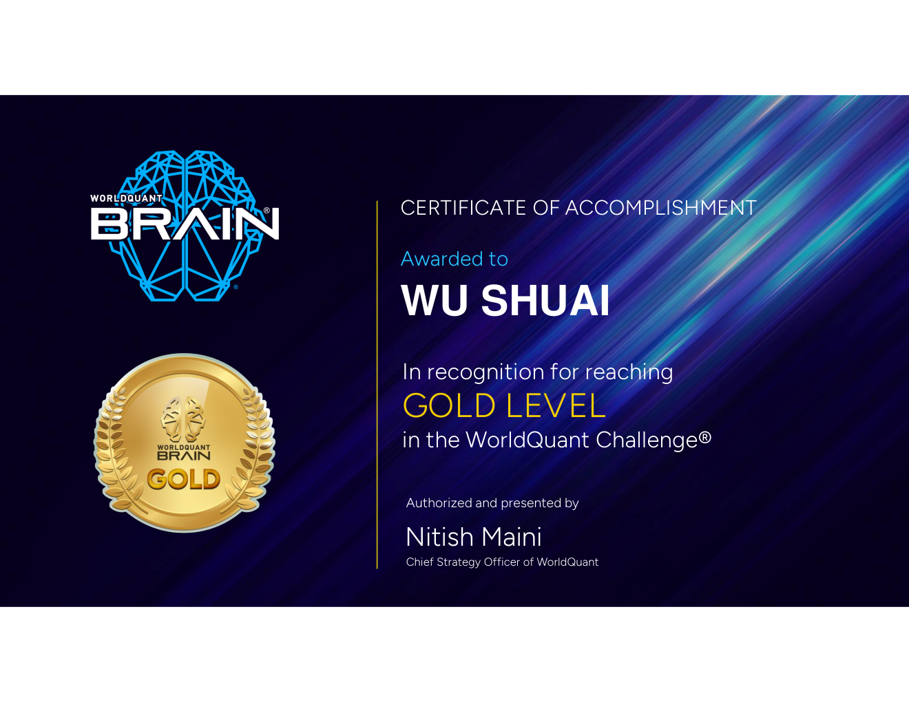
</p>

## Star History

<p align="center">
  <a href="https://www.star-history.com/#Asher-S-Wu/Vectaix-Finance&amp;Date">
    
  </a>
</p>
