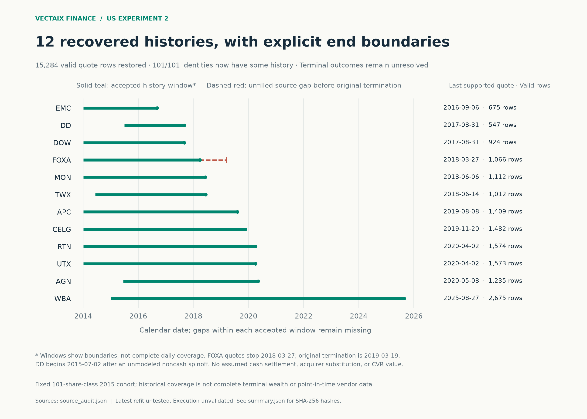

# US experiment 2: recovered histories and independently trained ranking weights

This is bounded, current-vintage retrospective research on the same 101 original OEF share classes dated 2015-06-30 and publicly known on 2015-09-02. It preserves the [initial experiment](../../../README.md#us-v1), model artifacts, results and figures. US models have their own fitted weights and USD labels; no A-share or Hong Kong trained weights are reused.

## Result and limits

The completed run selected **ridge_rank_5y** with a five-year development mean rank IC of **+0.0271497**. A chronological nested selection path has mean outer IC **+0.0008557**, with only one positive outer year out of three. The recent four-horizon IC point estimates are positive, but every 95% interval includes zero; probability Brier skill is negative at every horizon. The latest refit is not evaluated out of sample. `eligible=false` and `execution_validated=false` remain in force.

**REUSED DIAGNOSTIC, NOT A NEW HOLDOUT:** 2025-01-01 through 2026-09-30 was already examined in Experiment 1. It was excluded from v2 candidate choice but is still an already-viewed diagnostic period, not new independent confirmation.

## Data recovery is bounded

The 12 original identities previously unavailable now have accepted, bounded history: CELG, MON, WBA, TWX, AGN, APC, EMC, DOW, DD, RTN, FOXA and UTX. Together they add **15,284 valid quote rows** and **224 reconstructed ordinary split/cash action records**, as listed in the [admitted recovery coverage](recovery_coverage.csv). Having some history for 101/101 original identities does not establish a complete point-in-time universe, complete event accounting, or complete terminal shareholder wealth.



- FOXA's source ends on **2018-03-27**, while original trading ended **2019-03-19**. The dashed segment is an unresolved source gap, not an earlier termination.
- DD begins **2015-07-02**, after an unmodeled noncash Chemours spinoff. Earlier or cross-event labels are not supplied.
- WBA ends **2025-08-27**. Terminal merger entitlements and contingent consideration remain unmodeled.
- Unsupported cash-settlement, merger-stock, spinoff and CVR outcomes remain unknown. No presumed acquirer substitution or cash liquidation fills the gap.
- Full shared-calendar reindexing preserves missing sessions; there is no quote forward fill or compressed forecast horizon. Event reconstruction uses explicitly accepted source intervals and ordinary split/cash ledgers, with documented verification limits.
- Provider-history vintages are not point-in-time. Current data availability, identity boundaries, source corrections, missing outcomes and the fixed 2015 cohort can bias inference.

[Full source audit](../../../backtests/us/oef2015-rank-v2/source_audit.json) · [Recovery CSV](../../showcase/us/v2/source_recovery.csv) · [101-identity coverage CSV](../../showcase/us/v2/cohort_coverage.csv) · [Admission review](pre_fit_review.json) · [Remaining source limits](remaining_coverage_limits.json)

## Frozen design and chronological evaluation

The [pre-fit design](design.md) and [saved execution protocol](../../../backtests/us/oef2015-rank-v2/protocol.json) specify six candidates: unchanged factor reference, positive 12–1 momentum, Ridge ranking with 3-/5-year windows, and small regularized LightGBM ranking with 3-/5-year windows. The learned models use the same 24 features and exactly zero-centered within-date/horizon outcome ranks. The fixed factor reference retains four inputs; the 12–1 momentum baseline retains its one declared input. Targets require at least 20 mature outcomes; unsupported endpoints are absent. Rank preprocessing uses contemporaneously available cohorts; Ridge standardization and date-balanced weights are fitted only on training data.

The 2020–2024 folds each fit before the preceding calibration year and evaluate on one common stock-date and IC-date set across candidates. Annual outcome labels must mature within the evaluation year. Thirty candidate-fold fits were completed. The 2020 3-/5-year windows coincide because fitting cannot begin before 2016. Candidate choice is the greatest equally weighted mean of the five annual ICs, with a predefined simple-first tie order. Reported annual mean, median, worst year and positive-year counts are available in the CSV; selecting the winner on this statistic makes it a development result.


[Annual common-row results](../../showcase/us/v2/rolling_selection.csv) · [Candidate summary](../../showcase/us/v2/development_selection.csv) · [Frozen selection](../../../backtests/us/oef2015-rank-v2/frozen_architecture.json)

For nested evaluation, 2022 selects using 2020–2021, 2023 uses 2020–2022, and 2024 uses 2020–2023. No outer year enters its own architecture choice. All three select five-year Ridge, with outer IC **−0.0174575, +0.0275210, −0.0074963**. Their equal-weight mean is **+0.0008557**. This is a chronological architecture-selection diagnostic, still based on retrospective source data.


[Nested selection CSV](../../showcase/us/v2/nested_selection.csv)

## Frozen reused diagnostics and paired comparison

Final heads at 1, 5, 20 and 60 sessions train through 2023 and calibrate on 2024. The selected ranking scores have per-horizon logistic probability calibration, nonnegative-slope affine mean-return calibration, and volatility-scaled empirical log-return residual intervals. Parameters stay frozen during the reused recent diagnostic. No score inversion, candidate substitution or retrospective tuning is authorized by the recent results.


| Sessions | Mean IC | 95% IC interval | IC dates | Mature score outcomes | Brier skill | Interval coverage |
| --- | ---: | --- | ---: | ---: | ---: | ---: |
| 1 | +0.008338 | [−0.004240, +0.021148] | 436 | 38,966 | −0.011662% | 79.4026% |
| 5 | +0.015837 | [−0.013138, +0.043823] | 432 | 38,606 | −0.026247% | 81.7101% |
| 20 | +0.024206 | [−0.025540, +0.069590] | 417 | 37,256 | −0.286113% | 82.3706% |
| 60 | +0.070522 | [−0.003976, +0.141456] | 377 | 33,656 | −0.676693% | 83.6285% |

Each horizon retains **44,137 original-cohort predictions**, including missing or immature outcomes. IC is equally weighted daily cross-sectional Spearman correlation. The 95% bounds use 2,000 circular 60-session block-bootstrap draws with seed 42 and missing-day calendar slots preserved. Overlapping outcomes are not independent samples. The probabilities and intervals have task-specific mature available denominators, which the CSV preserves.

The [paired comparison](../../showcase/us/v2/paired_recent.csv) uses identical original-source labels, stock-date rows and IC dates for v1 and v2. At 20 sessions, v1 **−0.0771785** versus v2 **+0.0232899** yields change **+0.1004685**, with paired 95% block-bootstrap interval **[+0.0210951, +0.1787540]**, on **37,113 mature observations / 417 IC dates**. This differs from the full v2 +0.0242061 because full v2 includes additional recovered WBA observations. The model and training data changed together; this posthoc comparison does not isolate the recovery's causal effect and cannot establish independent confirmation.


Brier skill equals `1 − model Brier / historical-frequency baseline Brier`; negative is worse. q10–q90 targets 80% coverage. Calibration alone and interval coverage near 80% do not establish profitable or useful ranking. The separate **2026-09-30 latest refit has no out-of-sample evaluation**.

[Diagnostic CSV](../../showcase/us/v2/reused_diagnostic.csv) · [Frozen model metadata](../../../models/us/oef2015-rank-v2/frozen/model.json) · [Latest-refit summary](../../../backtests/us/oef2015-rank-v2/latest_refit_summary.json)

## Portfolio result remains unavailable

The unchanged monthly top-10, next-session-close research replay uses a 95% invested target, USD adjusted research units, 15 bps per side with a 30 bps stress case, and a 1% trading-value-proxy participation cap. These units are not actual exchange shares. Source-adjusted prices include distributions; no duplicate dividend cash is added.

The selected strategy, stress case and 101-slot cohort retain an unresolved WBA holding after **2025-08-27**, producing **274 valuation-gap sessions** through 2026-09-30. Their **full-period total return, CAGR, maximum drawdown and final valid NAV are null**. Any carried reference value is a diagnostic placeholder, not a validated wealth path, so no model wealth-performance chart is published. SPY's source-adjusted valuation proxy does not repair the strategy's unknown terminal entitlement. Execution remains unvalidated for every series.

The separate [WBA terminal-contract scenario audit](WBA_terminal_scenarios.json) records USD **11.45** contractual cash plus one restricted contingent right capped at USD **3.00** per original share. The initial 2029-08-28 deadline may extend. A disclosed fund's 2026-05-31 Level 3 mark of about USD **0.5693** per right is neither an observable market price nor verified payout. Cash receipt timing and final right settlement remain unverified; these illustrative contract bounds are not substituted into the frozen replay.

[Terminal-aware replay status CSV](../../showcase/us/v2/replay_status.csv) · [Replay assumptions and diagnostics](../../../backtests/us/oef2015-rank-v2/replay_summary.json)

## Reproduce the reporting artifacts

From the repository root, using the installed Python requirements:

```bash
python -m scripts.build_us_v2_showcase
python -m pytest tests/test_us_v2_showcase.py
```

This rebuilds five PNGs and aggregate CSV/JSON outputs from saved results and frozen model metadata only. It does not download quotes, consume per-security predictions, run models or repeat fitting. Use `--destination /tmp/us-v2-report` for a separate render. Figures and source artifacts are SHA-256 linked in [summary.json](../../showcase/us/v2/summary.json); the renderer rejects unfinished runs, inconsistent selection arithmetic, different candidate comparison samples, leaking nested chronology, stale hashes, inconsistent denominators and invalid promotion of unresolved replay returns. Training in a new namespace requires complete locally admitted data; saved runs cannot be overwritten.

## Chinese research report

[完整研究报告 PDF](../../../delivery_report/us/us_training_report.zh-CN.pdf) · [可编辑 Word 版本](../../../delivery_report/us/us_training_report.zh-CN.docx) · [发布与复现说明](../../../US_RESEARCH_RELEASE.zh-CN.md)
